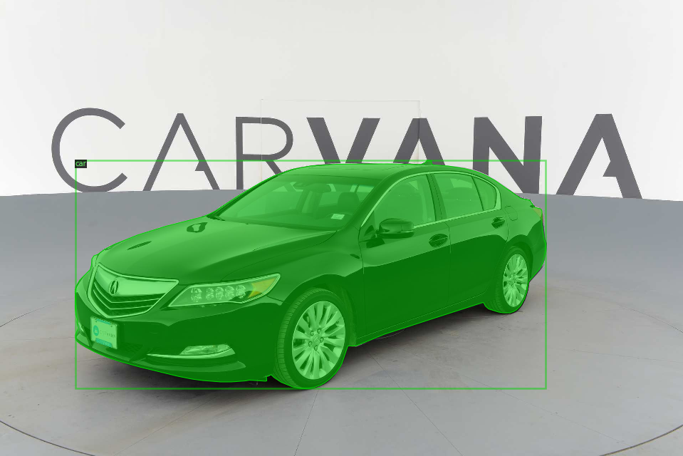
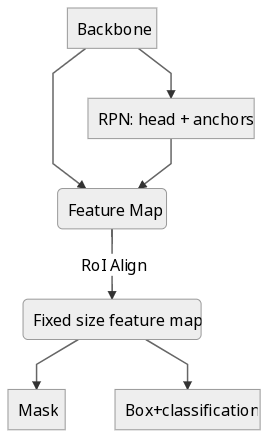

# Carvana
This project aims at segmenting cars on 360° indoor studio shootings using
[Detectron2](https://github.com/facebookresearch/detectron2) to perform instance
segmentation over a volume of images. It is still a work in progress.

## Dataset
The dataset used is taken from this [Kaggle Challenge](https://www.kaggle.com/c/carvana-image-masking-challenge/).

## Architecture

carvana
├── __init__.py
├── data
│  ├── __init__.py
│  ├── build.py
│  ├── mapper.py
│  └── utils.py
├── model
│  ├── __init__.py
│  ├── anchor_generator.py
│  ├── backbone.py
│  ├── meta_arch.py
│  └── rpn.py
└── train.py

## How to run
First you need to download the [Carvana dataset ](https://www.kaggle.com/c/carvana-image-masking-challenge/data).
This code require CUDA10 in order to work, so it can run in colab, please see
`notebooks/training.ipynb`.
To run it locally, first run `pip install -r requirements.txt` then
you can launch the training with `python3 carvana/train.py --config-file
configs/Flow-RCNN-3DRPN-v1.yaml`.
